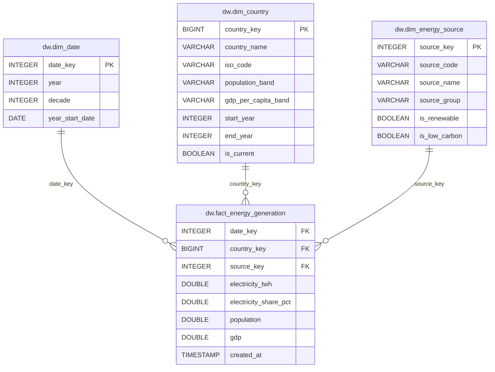

# Diagrama do Modelo Estrela

**Autores:** Rodolfo Vinicius Cima Takemoto; Tiago Galhardo Avelar  
**Projeto:** Data Warehouse de Energia e Sustentabilidade  
**Data de entrega:** 03/06/2026



## Grão da Tabela Fato

`dw.fact_energy_generation` possui uma linha por:

- país;
- ano;
- fonte de energia.

## Observação Sobre SCD Type 2

A dimensão `dw.dim_country` cria novas versões históricas quando há alteração em:

- `population_band`;
- `gdp_per_capita_band`.

A fato se conecta à versão válida para o ano da observação usando a condição:

```sql
o.year BETWEEN c.start_year AND c.end_year
```

